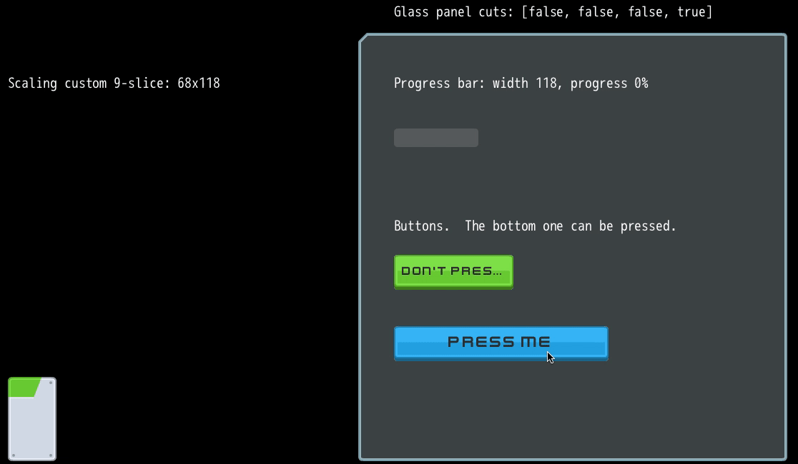

# UI Sample

This is a demonstration of some simple UI elements, based on the excellent free assets at [kenney.nl](https://www.kenney.nl/)
- Self-truncating labels
- 9-slice resizable panels
  - A simple glass panel with two options for each corner
  - A complex metal panel where the top edge transitions from blue to metal, with a header label inside
  - A very simple cutout for the above panel
- Progress bars
- Interactive buttons with labels

It's built on some library code:
- `Sprite` helper class, tying together `Assignable`, `Serializable` and `attr_sprite`
  - Easy to setup new sprites using `Sprite.new.tap {|s| s.x = 5 ... }`
- `ComplexSprite` is the basis for many of these, it's a way of combining individual sprites into something that can be
  displayed and modified as a whole using render_targets.
- `TwoStageButton`, `ThreePanel`, `NinePanel`, `NinePanelEdge`

The idea is that you could drop the `app/lib/ui` folder into your project, and create custom elements as in `app/ui`

#### Experiment with this code!
Source is under MIT License and available at [https://github.com/danhealy/dragonruby-ui-sample](https://github.com/danhealy/dragonruby-ui-sample)

Kenney assets are under CC0 license, including modifications made by me to allow for pixel scaling

Suggested things to try:
- Build out the vertical progress bars!  This is currently left as a todo.
- Add some more elements from Kenney's assets
- Try creating a nine-slice panel without splitting the assets apart, using `source_[x/y/w/h]`

#### Changelog
- July 28 2020: Moved the `lib/*` stuff to `Zif` namespace, so it can be reused by others more easily
- July 27 2020: Initial commit
